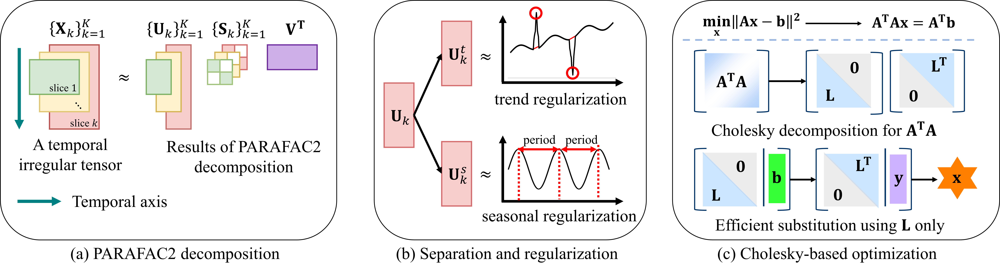

# PARADISE
This is the official implementation of "Accurate and Interpretable Decomposition for Temporal Irregular Tensors with Missing Values via Trend–Seasonality Separation". 

## Overview of PARADISE


## Abstract
Given a temporal irregular tensor with missing values, how can we accurately decompose the tensor and obtain interpretable latent factors?
A temporal irregular tensor is a collection of matrices that share the columns, while the number of rows differs across matrices, corresponding to time. Missing values inevitably occur in real-world datasets due to errors, sensor malfunctions, and transmission failures. Many real-world datasets such as traffic data naturally take this form.
Previous studies adopt PARAFAC2 decomposition to analyze temporal irregular tensors, since it handles variable-length of slices while maintaining column consistency. They often add temporal regularization to capture sequential dependencies, and compute the loss on observed entries only, leading to a row-wise update scheme and improved accuracy in the presence of missing values.
However, there are still several challenges that existing methods have not addressed. First, the temporal factors obtained from PARAFAC2 are hard to interpret, as long-term trends and seasonal patterns are entangled into a single latent factor. Second, row-wise update procedures incur high computational costs because each row requires a matrix inversion, although they are effective at handling missing values.

In this paper, we propose PARADISE, an accurate and interpretable decomposition method for temporal irregular tensors with missing data, separating trend and seasonal factors. PARADISE explicitly separates the temporal latent factor into trend and seasonal components, and applies dedicated regularization to each component to ensure their disentanglement.
Furthermore, we accelerate row-wise updates by leveraging the symmetry of the inverse terms and using Cholesky decomposition to reduce computational costs. PARADISE achieves up to 16.5% improvement in missing value prediction over existing methods, while also reducing runtime and providing interpretable temporal factors that separate trend and seasonality.

## Code Information
All code is written in **MATLAB R2025a**. This repository contains the implementation of **PARADISE**, an accurate and interpretable decomposition method for temporal irregular tensors with missing data, separating trend and seasonal factors.
Given an irregular tensor with missing values, PARADISE accurately finds latent factors by decomposition.
The main code is located in the `src/` directory.

### Requirements (Toolboxes)
We need the following Toolboxes to run our proposed method.
- **Parallel Computing Toolbox**
- **Signal Processing Toolbox**
- **Statistics and Machine Learning Toolbox**

### How to Run
Before you run PARADISE, you should add paths into MATLAB environment. Please type:
```
run addPaths
```
Or, you manually add paths for `src` and `library` directories.
Then, type the following command to run data:
```
run main.m
```

## Data Overview
We utilize five benchmark datasets. To get started, download each dataset from the provided official links.
|        **Dataset**        |                  **Link**                   |
|:-------------------------:|:-------------------------------------------:|
|       **PEMS-SF**        |           `https://archive.ics.uci.edu/dataset/204/pems+sf`           |
|       **VicRoads**        |           `https://github.com/florinsch/BigTrafficData`           |
|       **METR-LA**        |           `https://www.kaggle.com/datasets/annnnguyen/metr-la-dataset`           |
|       **Electricity**        |           `https://archive.ics.uci.edu/dataset/321/electricityloaddiagrams20112014`           |
|       **Forbes2000**        |           `https://www.kaggle.com/datasets/paultimothymooney/stock-market-data`           |
